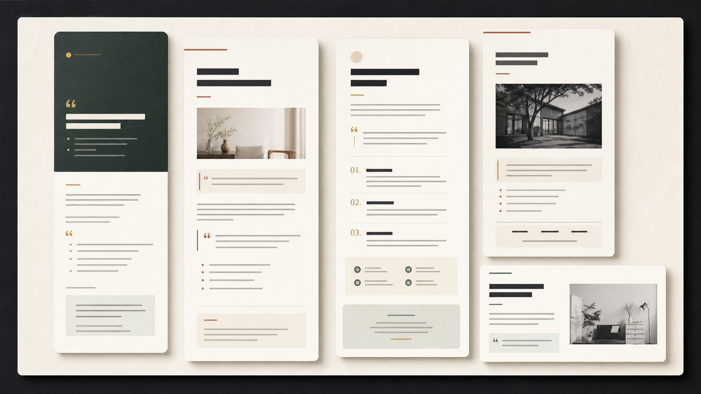
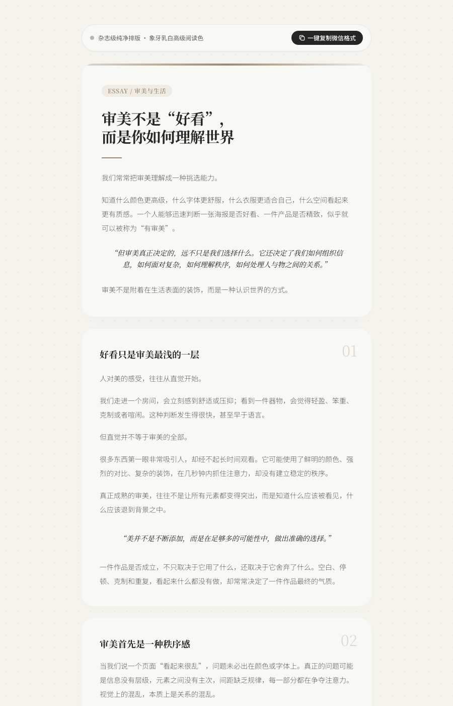

# gzh-minimal-layout

一个面向微信公众号文章的智能排版 agent Skill。它把文章理解、阅读节奏、主题选择和 HTML 渲染拆成可追踪的中间合同，让 Agent 负责“怎么排”，让 Renderer 负责“稳定地排出来”。

项目适合需要将 Markdown 或纯文本文章转换为微信公众号 HTML 的开发者，也适合作为 Agent 驱动内容工具的排版基础设施。



## 项目特点

- **结构化文章理解**：将原始文章拆解为文章画像、语义 Block 和阅读计划，保留来源可追溯关系。
- **Agent 与 Renderer 分工**：Agent 决定文章结构、阅读节奏、主题和组件取舍；Renderer 只消费经过校验的合同，不重新猜测语义。
- **主题与组件系统**：通过主题 Token、组件能力和模板插槽组织视觉表现，支持多种编辑式、文学式和杂志式主题。
- **微信公众号适配**：生成适合公众号编辑器的内联 HTML，同时提供调试预览、375px 预览和清洁预览。
- **内容完整性保护**：渲染前后校验来源 Block，避免遗漏、重复、改写或无依据的内容重排；图片等外部资产也必须经过独立合同验证。
- **可测试、可复现**：关键阶段都有 JSON Schema、CLI 命令和自动化测试，生成物默认写入临时目录，不污染源码。

## 核心流程

```text
Raw Article → SourceManifest → Agent ArticleProfile + BlockDocument
→ Agent ReadingPlan → Theme Candidates → Agent Selections
→ LayoutPlan → Component Renderer → WeChat HTML + 375px previews
```

- 原文是唯一内容来源，任何遗漏、重复、改写或重排都会失败。
- baseline 分析只提供来源可追溯的合同骨架，最终交付应使用 Agent 编写的三份分析合同。
- Agent 决定文章画像、语义结构、阅读节奏、主题和候选取舍。
- Theme 决定组件能力、Token、间距档位和强调预算。
- Renderer 不重新解释语义，只绑定安全插槽、生成内联样式并验证内容完整性。



## 使用

```bash
# 仅首次使用或 node_modules 不存在时
npm install
npm run typecheck
npm test
```

如需生成来源骨架，显式运行 baseline 模式：

```bash
npm run --silent cli -- workflow run \
  --input article.md \
  --mode baseline \
  --theme quiet-editorial \
  --output /tmp/article-baseline.wechat.html \
  --artifacts-dir /tmp/article-baseline-artifacts
```

阅读原文和 baseline 后，按 `schemas/` 编写 `ArticleProfile`、`BlockDocument` 与 `ReadingPlan`，再运行正式 Agent 工作流。`workflow run` 默认就是 Agent 模式：

```bash
npm run --silent cli -- workflow run \
  --input article.md \
  --agent-profile agent/article-profile.json \
  --agent-blocks agent/block-document.json \
  --agent-reading agent/reading-plan.json \
  --theme whitespace-journal \
  --selections selections.json \
  --output /tmp/article.wechat.html \
  --preview /tmp/article.debug.html \
  --clean-preview /tmp/article.preview.html \
  --artifacts-dir /tmp/article-artifacts
```

没有自定义候选选择时可省略 `--selections`。三份 `--agent-*` 输入必须一起出现；正式结果应报告 `analysisMode: "agent"` 和 `contentIntegrity.valid: true`。

完整 Agent 操作规范见 [SKILL.md](SKILL.md) 和 [references/agent-workflow.md](references/agent-workflow.md)。

## 主题

| 主题 | 视觉方向 | 适合内容 |
| --- | --- | --- |
| `quiet-editorial` | 开放、安静、编辑式 | 通用长文、知识解释 |
| `forest-order` | 森林绿、香槟金、章节仪式感 | 结构丰富、判断鲜明的正式长文 |
| `whitespace-journal` | 暖纸、非对称轨道、克制留白 | 随笔、叙事、文学表达 |
| `prussian-judgment` | 冷墨蓝、封面叠字、窄幅章节 | 判断、决策、观点型长文 |
| `brick-literary` | 砖红纸张、首字下沉、章节仪式 | 文学感叙事、阅读方法 |
| `champagne-editorial` | 香槟金、居中题头、细线轨道 | 编辑式知识长文 |
| `cobalt-essay` | 冷白纸张、极简字距、开放正文 | 随笔、观点、散文 |
| `minimal-magazine` | 纯白杂志、极宽字距、轻量分隔 | 品牌文章、设计评论 |
| `moss-staircase` | 苔绿宣纸、阶梯偏移、长节奏 | 生活方式、叙事长文 |
| `efficiency-system` | 现代冷灰、圆角模块、编号章节 | 方法论、效率与工具 |
| `warm-card-magazine` | 暖灰背景、卡片章节、柔和强调 | 杂志式知识文章 |

所有主题都通过 `component.json + template.html` 声明能力。结构组件只能使用 `BlockDocument` 已声明的来源字段；没有真实图片 URL 时不会制造图片。

## 目录

```text
SKILL.md                   Codex Skill 入口与交付规范
agents/openai.yaml         Skill UI 元数据与默认提示
references/                Agent 工作流参考
schemas/                   JSON 合同
src/agent/                 baseline 分析与 Agent 合同交叉校验
src/reading/               主题无关的 ReadingPlan
src/theme/                 主题加载、候选解析与模板安全
src/presentation/          LayoutPlan 与组件渲染
src/adapters/              微信公众号输出适配
themes/                    现有主题与组件模板
fixtures/                  最小测试夹具与完整 Agent 示例
tests/                     当前主链路测试
```

组件开发规范见 [docs/COMPONENT_LIBRARY.md](docs/COMPONENT_LIBRARY.md)。最小 Agent 流程夹具位于 `fixtures/agent-workflow/`。

## 验证

```bash
npm run typecheck
npm test
npm run build
npm run skill:validate
```

用户最终只需要 `<slug>.wechat.html`；`preview.html`、`debug.html`、`artifacts/` 和 baseline HTML 都是内部或按需检查产物。生成物默认写到 `/tmp`；仓库内的 `dist/`、`outputs/`、`previews/` 和任务 artifacts 均被忽略，可随时重新生成。
